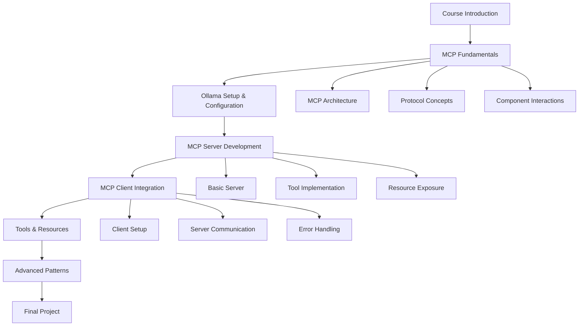

# Design Document

## Overview

The MCP Course with Ollama is designed as a comprehensive, hands-on educational platform that teaches developers how to build and integrate Model Context Protocol (MCP) systems using local LLMs via Ollama. The course follows a progressive learning approach, starting with fundamental concepts and advancing to practical implementation of MCP Servers and Clients.

The course emphasizes privacy-by-design principles by utilizing Ollama for local LLM hosting, ensuring all AI processing remains on the learner's machine without external API dependencies.

## Architecture

### Course Structure



### Learning Progression

1. **Foundation Layer**: Core MCP concepts and terminology
2. **Setup Layer**: Ollama installation and configuration
3. **Implementation Layer**: Hands-on MCP Server and Client development
4. **Integration Layer**: Connecting components and advanced patterns
5. **Application Layer**: Real-world project implementation

## Components and Interfaces

### Course Modules

#### Module 1: MCP Fundamentals
- **Objective**: Establish foundational understanding of MCP architecture
- **Components**:
  - Interactive diagrams showing MCP ecosystem
  - Conceptual explanations of Servers, Clients, Tools, Resources, and Prompts
  - Comparison with traditional API patterns
- **Deliverables**: Knowledge assessment quiz

#### Module 2: Ollama Integration
- **Objective**: Set up privacy-focused local LLM environment
- **Components**:
  - Ollama installation guide for multiple platforms
  - Model selection and optimization strategies
  - Performance tuning for local deployment
- **Deliverables**: Working Ollama installation with selected models

#### Module 3: MCP Server Development
- **Objective**: Build functional MCP Servers from scratch
- **Components**:
  - Server scaffolding and basic structure
  - Tool definition and implementation patterns
  - Resource exposure mechanisms
  - Error handling and validation
- **Deliverables**: Functional MCP Server with custom tools

#### Module 4: MCP Client Implementation
- **Objective**: Create clients that interact with MCP Servers
- **Components**:
  - Client initialization and configuration
  - Server discovery and connection management
  - Request/response handling patterns
  - Integration with Ollama-hosted LLMs
- **Deliverables**: Working MCP Client application

#### Module 5: Advanced Integration Patterns
- **Objective**: Implement complex MCP scenarios and best practices
- **Components**:
  - Multi-server orchestration
  - Security and authentication patterns
  - Performance optimization techniques
  - Debugging and monitoring strategies
- **Deliverables**: Advanced MCP application with multiple integrations

### Technical Components

#### Code Examples Repository
- **Structure**: Organized by module with progressive complexity
- **Languages**: Python (primary focus for all implementations)
- **Format**: Jupyter notebooks for interactive learning, standalone Python scripts for reference
- **Libraries**: `mcp` package, `ollama` Python client, `asyncio` for async patterns

#### Interactive Learning Environment
- **Platform**: Web-based interface with embedded code execution
- **Features**: 
  - Live code editing and execution
  - Ollama integration for real-time LLM interaction
  - Progress tracking and assessment tools

#### Documentation System
- **API Reference**: Comprehensive MCP protocol documentation
- **Troubleshooting Guide**: Common issues and solutions
- **Best Practices**: Design patterns and implementation guidelines

## Data Models

### Course Progress Model
```python
from dataclasses import dataclass
from datetime import datetime
from typing import List, Optional, Literal

@dataclass
class ExerciseCompletion:
    exercise_id: str
    completed: bool
    code_submission: Optional[str] = None
    feedback: Optional[str] = None

@dataclass
class CourseProgress:
    user_id: str
    module_id: str
    completion_status: Literal['not_started', 'in_progress', 'completed']
    assessment_score: Optional[int] = None
    last_accessed: datetime = datetime.now()
    practical_exercises: List[ExerciseCompletion] = None
```

### MCP Learning Resources Model
```python
from dataclasses import dataclass
from typing import List, Dict, Any

@dataclass
class MCPTool:
    name: str
    description: str
    parameters: Dict[str, Any]
    implementation: str  # Python code example

@dataclass
class MCPResource:
    uri: str
    name: str
    description: str
    mime_type: str

@dataclass
class MCPServer:
    name: str
    description: str
    tools: List[MCPTool]
    resources: List[MCPResource]
    configuration: Dict[str, Any]
```

### Ollama Integration Model
```python
@dataclass
class OllamaConfig:
    model_name: str
    endpoint: str = "http://localhost:11434"
    parameters: Dict[str, Any] = None
    privacy_settings: Dict[str, Any] = None
    
    def __post_init__(self):
        if self.parameters is None:
            self.parameters = {
                "temperature": 0.7,
                "max_tokens": 2048,
                "context_window": 4096
            }
        if self.privacy_settings is None:
            self.privacy_settings = {
                "local_only": True,
                "data_retention": "none"
            }
```

## Error Handling

### Learning Environment Errors
- **Connection Issues**: Graceful degradation when Ollama is unavailable
- **Code Execution Errors**: Sandboxed environment with clear error messages
- **Progress Sync Issues**: Local storage fallback with sync recovery

### MCP Implementation Errors
- **Server Communication**: Timeout handling and retry mechanisms
- **Protocol Violations**: Clear validation messages and correction guidance
- **Resource Access**: Permission and availability error handling

### Ollama Integration Errors
- **Model Loading**: Fallback models and clear loading status
- **Performance Issues**: Resource monitoring and optimization suggestions
- **Configuration Problems**: Validation and auto-correction where possible

## Testing Strategy

### Course Content Testing
- **Accuracy Validation**: Technical review of all MCP concepts and code examples
- **Learning Effectiveness**: User testing with target developer audience
- **Progressive Difficulty**: Validation that each module builds appropriately on previous knowledge

### Code Example Testing
- **Functional Testing**: All code examples must execute successfully
- **Integration Testing**: MCP Server/Client interactions with Ollama
- **Cross-Platform Testing**: Validation across different operating systems

### Privacy and Security Testing
- **Data Locality**: Verification that no data leaves local environment
- **Ollama Security**: Testing of local model security and isolation
- **Code Sandbox**: Security testing of interactive code execution environment

### Performance Testing
- **Ollama Performance**: Testing with various model sizes and hardware configurations
- **Learning Platform**: Load testing for concurrent users
- **Resource Usage**: Memory and CPU optimization validation

## Implementation Considerations

### Privacy-by-Design Implementation
- All LLM processing through local Ollama instances
- No external API calls for AI functionality
- Local storage for user progress and preferences
- Optional telemetry with explicit opt-in

### Accessibility and Inclusivity
- Screen reader compatible interface
- Multiple learning modalities (visual, textual, hands-on)
- Adjustable difficulty levels and pacing
- Multi-language support for core concepts

### Platform Compatibility
- Cross-platform Ollama setup instructions
- Docker-based development environment options
- Web-based interface for universal access
- Offline capability for core learning materials